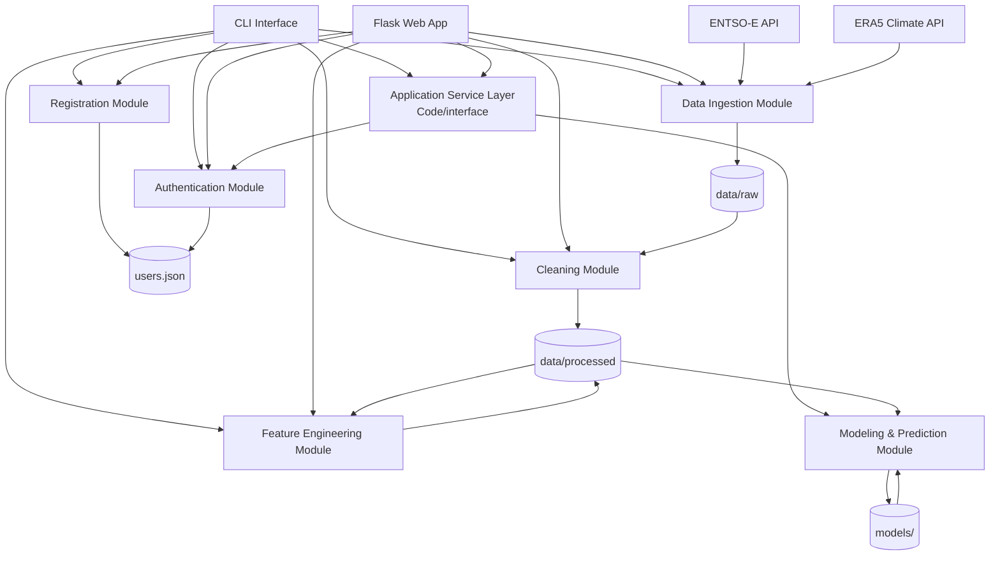

# System Architecture

## 1. Overview

The Climate-Driven Energy Demand Analytics System is built as a modular, data-oriented architecture in which each component has a single, well-defined responsibility. Data flows sequentially through five processing stages (ingestion → cleaning → feature engineering → modeling → prediction), and an authentication layer mediates access to every state-changing or sensitive operation.

The system integrates two external data sources:

- **ENTSO-E API** — hourly electricity demand data for Portugal
- **ERA5 (Copernicus Climate Data Store)** — hourly climate data (temperature, wind, solar radiation, precipitation)

End users interact with the system through one of two interchangeable interfaces, both backed by the same underlying components:

- A **Command Line Interface** (`cli.py`) for terminal users
- A **Flask Web Application** (`app.py`) with role-based dashboards for browser users

This architectural design satisfies the specification's required minimum components — a data ingestion layer, a cleaning and transformation layer, a feature engineering module, a modeling component, a prediction interface, and an authentication layer — and adds an **Application Service Layer** that mediates between the user interfaces and the modeling subsystem.

---

## 2. System Diagram

The diagram shows three structural layers:

- **Interaction layer** (top): CLI and Web App, the two entry points for end users
- **Service layer** (middle): the Application Service Layer that mediates between interfaces and the modeling subsystem
- **Pipeline layer** (bottom): the modules that ingest, transform, learn from, and predict on the data, plus the authentication layer that gates access to all of them

---

## 3. Components

### 3.1 User Interaction Layer

**CLI Interface (`cli.py`)** is the terminal-based entry point. It handles authentication (login/registration), provides role-based menus, and lets the user trigger every backend operation: data exploration, pipeline execution (admin), training (admin), metrics inspection, prediction, and admin promotion.

**Flask Web Application (`app.py`)** is the browser-based entry point. It renders the login/registration page, serves role-based dashboards (`Design/admin.html` for admins, `Design/user.html` for regular users), and exposes JSON APIs for data exploration and HTTP routes for every pipeline operation. Two helpers gate sensitive routes: `require_admin()` enforces role checks for admin-only routes, and `confirm_password()` re-validates the session user's password before sensitive admin operations like training and metrics inspection.

Both interfaces share the same authentication module, the same trained models, and the same `system_actions.log`, so a user account works identically in both.

---

### 3.2 Application Service Layer

The Application Service Layer (`Code/interface/prediction_service.py`) is the orchestration boundary between user interfaces and the modeling subsystem. Every sensitive modeling operation — training, prediction, metrics inspection — is routed through it, and every call is gated by `_ensure_authenticated()`, which verifies credentials and (optionally) admin role before delegating to the modeling module.

This layer is the concrete realisation of the conceptual "Application API" described in the project specification: a single, authentication-gated coordination point between user interaction and the modeling subsystem. Centralizing access here means authentication logic does not have to be duplicated across the CLI and the web app, and that future user interfaces (e.g. a mobile client) could plug in without changing the modeling code.

---

### 3.3 Authentication Layer

The Authentication Layer (`Code/auth/auth_service.py`) is responsible for registering users, validating credentials, enforcing role-based permissions, and storing user data securely.

**Components:**
- `register_user` — validates input (non-empty username, password ≥ 8 characters), hashes the password with bcrypt, and persists the credentials to `users.json`
- `authenticate_user` — verifies a username and password against the stored bcrypt hash
- `get_user_role` — returns `"user"` or `"admin"` for an authenticated user
- `promote_to_admin` — lets an existing admin grant admin privileges to another user

The authentication layer is invoked from three different places, depending on context:

1. **At login**, by both the CLI and the Flask web app
2. **Inside the Application Service Layer**, before every sensitive modeling operation (via `_ensure_authenticated`)
3. **Inside the Flask web app**, before sensitive admin routes (via the `confirm_password` helper), providing a second password check on top of the session cookie

This layered approach means a single stolen session cookie is not sufficient to trigger model training, metrics inspection, or other high-impact admin actions on the web — the user must also re-prove identity with the password.

---

### 3.4 Data Pipeline

The pipeline produces a trained model and the data it needs to make predictions. It runs as four sequential modules:

**Data Ingestion (`Code/ingestion/`)** retrieves raw data from the external APIs. The ENTSO-E client (`entsoe_client.py`) downloads hourly electricity load data; the ERA5 client (`era5.py`) downloads hourly climate variables. Raw data is stored under `data/raw/energy/` and `data/raw/weather/` without manual modification, satisfying the reproducibility requirement of the specification.

**Cleaning Module (`Code/cleaning/merge_datasets.py` plus the cleaning logic in `Code/ingestion/entsoe_client.py`)** transforms raw data into a single aligned time series. It removes duplicate timestamps (keeping the first occurrence), reindexes the energy series onto a complete hourly index for 2025, normalizes timezones to UTC, forward/backward fills missing values, and merges the energy and weather series with `merge_asof` and a one-hour tolerance. The output lives in `data/processed/`.

**Feature Engineering (`Code/features/`)** turns the cleaned dataset into predictive features. Base features (`base_features.py`) include temporal context (hour, day, month, weekend, season), lagged demand (1h, 24h), and rolling climate averages (3h, 24h temperature). Advanced features (`advanced_features.py`) add temperature anomaly relative to monthly mean, a heatwave indicator, non-linear interaction terms, feels-like temperature, and one-hot encoded seasons. Outputs live in `features_v1.csv` and `features_v2_advanced.csv`.

**Modeling and Prediction (`Code/modeling/`)** trains and serves models. `model_training.py` performs a time-aware 80/20 split (no shuffling), trains a Linear Regression baseline and a regularised Random Forest (`n_estimators=200`, `max_depth=12`, `min_samples_leaf=50`, `min_samples_split=100`, `max_features='sqrt'`, `random_state=42`), evaluates both on MAE/RMSE/R², checks for overfitting (test MAE *and* test RMSE both exceeding 2.5× the corresponding train value), and persists artifacts to `models/<name>_<timestamp>.joblib`. `evaluation.py` computes the metrics and the residuals dataframe. `predict.py` loads a saved model and produces predictions for an input feature subset, realigning columns to the model's `feature_names_in_`. `model_utils.py` handles joblib persistence and the JSON metrics history.

All modules log progress and outcome to `system_actions.log` and are reachable from both interfaces (with admin role required for pipeline execution and training).

---

## 4. Data Flow

The system implements two distinct flows: the **pipeline flow** that builds models, and the **request flow** that uses them.

### 4.1 Pipeline flow (model preparation)

This is the one-directional flow that transforms raw external data into a trained, persisted model. It runs end-to-end the first time the system is set up, and any stage can be re-run independently afterwards because each stage caches its output to disk.

1. **Ingestion** — the ENTSO-E and ERA5 clients download raw data and write to `data/raw/energy/` and `data/raw/weather/` respectively.
2. **Cleaning** — duplicates are removed, timestamps normalized to UTC, missing values forward/backward filled, and the energy and weather series merged on the same hourly index. The output is written to `data/processed/`.
3. **Feature engineering** — temporal context, lagged demand, rolling climate averages, and advanced derived variables are computed from the cleaned data. Output is written to `features_v1.csv` and `features_v2_advanced.csv` in `data/processed/`.
4. **Training** — a time-aware 80/20 split is performed on the feature dataset, both models are trained and evaluated, and the resulting estimators are serialised to `models/<name>_<timestamp>.joblib`. The metrics history is appended to `models/model_metrics.json`.

Each pipeline stage is admin-only, executed from the CLI menu or from `POST /api/pipeline/{ingestion,cleaning,features}` and `POST /api/train` in the web app.

### 4.2 Request flow (prediction)

When a user requests a prediction, no new data is ingested. The system loads a previously trained model and runs it on a feature vector built from the user's input.

1. The user submits a prediction request through the CLI or the web app.
2. The Authentication Layer validates credentials. On the web, sensitive admin routes additionally require a password re-confirmation through `confirm_password()`.
3. The Application Service Layer receives the validated request, loads a saved model from `models/`, and prepares the feature input (computing any advanced features the user did not explicitly provide).
4. The model produces predictions, the service layer returns them along with timestamps, and the interface renders the result to the user.

All operations on both flows are logged to `system_actions.log` with the username, role, action, and outcome.

---

## 5. Data Storage

| Location | Purpose |
|----------|---------|
| `users.json` | Registered users with bcrypt-hashed passwords and roles |
| `data/raw/energy/` | Original ENTSO-E data, unmodified |
| `data/raw/weather/` | Original ERA5 data, unmodified |
| `data/processed/` | Cleaned, aligned, merged, and feature-engineered datasets (`energy_load_PT_2025_hourly_clean.csv`, `era5_portugal_processed.csv`, `merged.csv`, `features_v1.csv`, `features_v2_advanced.csv`) |
| `models/` | Trained scikit-learn estimators serialised with joblib (one file per training run), plus the cumulative metrics history in `model_metrics.json` |
| `system_actions.log` | Chronological record of authentication attempts, pipeline executions, training runs, and prediction requests |

The strict separation between raw and processed data ensures the original datasets are never overwritten and the pipeline remains reproducible from the source data alone.

---

## 6. How the Architecture Supports Quality Attributes

This section discusses how the **architectural choices** support the three non-functional attributes required by the specification. For the detailed scenarios and measurements of each attribute, see [`../Requirements/QUALITY_ATTRIBUTES.md`](../Requirements/QUALITY_ATTRIBUTES.md).

### 6.1 Performance

The pipeline is structured so that **each stage caches its output to disk**, which means downstream operations can reuse work without re-running upstream stages. Models persist to `models/` once trained, so prediction is a single file load and one model call — keeping prediction well under the 1-second budget mandated by the specification. Sequential pipeline execution avoids concurrency overhead in a problem that is naturally batch-oriented.

### 6.2 Reliability

The modular boundaries mean a failure in one component (e.g. an external API outage during ingestion) does not corrupt downstream artifacts. Defensive imports for optional dependencies (`cdsapi`, `cfgrib`) keep the system runnable even when those libraries are absent. Action logging through `system_actions.log` makes failures observable. Tests are structured around the same module boundaries, so each component can be validated in isolation.

### 6.3 Security

Security is layered. The authentication module is the single source of truth for credentials and role lookups, used identically by the CLI and the web app. The Application Service Layer prevents the modeling subsystem from ever being called without first going through authentication. The web app adds a third layer — password re-confirmation — for sensitive admin operations, mitigating the risk of session hijacking on shared workstations. No credentials are hardcoded anywhere; API keys and secrets are loaded from environment variables and `.env` is git-ignored.

---

## 7. Key Architectural Decisions

A few choices were made explicitly because of how they affect the system's qualities:

**Two interaction layers, one backend.** Both the CLI and the Flask web app delegate to the same modules. This avoids logic duplication and makes the system testable at the module level rather than only end-to-end.

**A dedicated Application Service Layer.** Centralizing authentication-gated access to modeling means the modeling code itself stays unaware of users and roles, which keeps it pure and easy to test. The same service layer would let a future interface (e.g. a mobile client) plug in without modifying the modeling code.

**Cached intermediate outputs.** Each pipeline stage writes its output to disk before the next stage runs. This trades disk space for the ability to re-run any stage independently and for faster startup of common operations.

**Layered authentication.** The session cookie alone is enough for read-only operations (data exploration, user-facing prediction), but state-changing or sensitive admin operations require a fresh password confirmation. This balances usability for low-risk operations with caution for high-risk ones.

**Time-aware train/test split.** The split is performed by sorting the dataset by timestamp and taking the first 80% as training data and the last 20% as test. No shuffling. This respects the temporal structure of the data — required by the specification — and means the reported test metrics reflect realistic forward-prediction behaviour rather than in-sample fitting.
